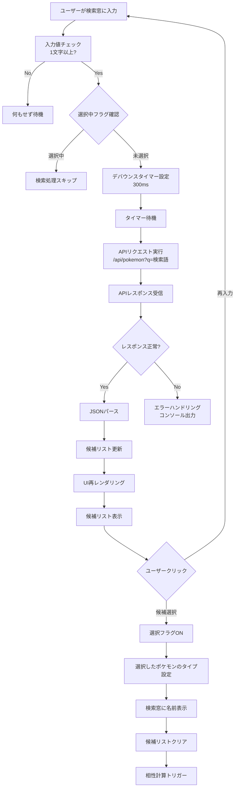
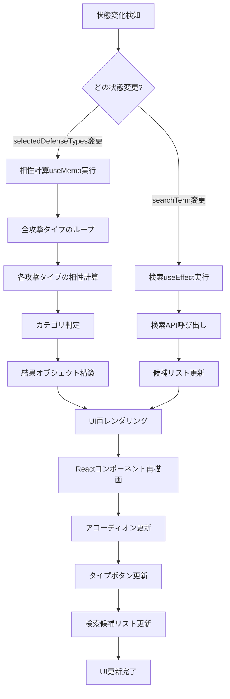
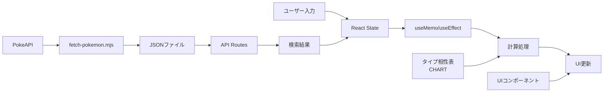
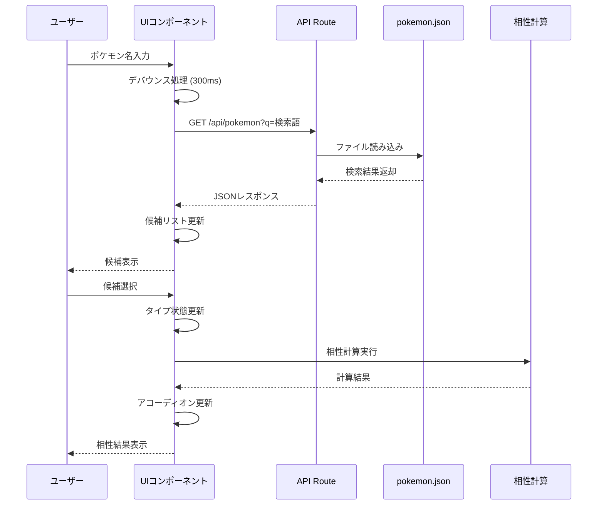

# ポケモンタイプ相性シミュレーター - 処理フロー図

## 全体システムフロー

```mermaid
graph TD
    A[ユーザーアクセス] --> B[アプリ初期化]
    B --> C[初期状態設定<br/>デフォルト: ノーマルタイプ]

    C --> D{ユーザーの操作}
    D -->|ポケモン名検索| E[検索処理]
    D -->|タイプ手動選択| F[タイプ選択処理]
    D -->|結果閲覧| G[相性計算・表示]

    E --> H[検索API呼び出し]
    H --> I[APIレスポンス処理]
    I --> J[候補リスト表示]
    J --> K{ユーザーが選択}
    K -->|選択| L[タイプ自動設定]
    K -->|未選択| E

    F --> M[タイプボタンクリック]
    M --> N[選択状態更新<br/>最大2タイプまで]
    N --> O[視覚的フィードバック<br/>リング強調]

    L --> P[相性計算開始]
    O --> P
    C --> P
    G --> P

    P --> Q[全18攻撃タイプのループ]
    Q --> R[防御タイプとの相性取得<br/>CHART[攻撃][防御]]
    R --> S{複数防御タイプ?}
    S -->|単一| T[相性値そのまま使用]
    S -->|複数| U[相性値を乗算]

    T --> V[効果倍率判定]
    U --> V

    V --> W{倍率 >= 4.0}
    W -->|Yes| X[ちょうバツグン]
    W -->|No| Y{倍率 >= 2.0}
    Y -->|Yes| Z[バツグン]
    Y -->|No| AA{倍率 == 1.0}
    AA -->|Yes| BB[等倍]
    AA -->|No| CC{倍率 >= 0.5}
    CC -->|Yes| DD[いまひとつ]
    CC -->|No| EE{倍率 >= 0.25}
    EE -->|Yes| FF[かなりいまひとつ]
    EE -->|No| GG[効果なし]

    X --> HH[カテゴリ別グループ化]
    Z --> HH
    BB --> HH
    DD --> HH
    FF --> HH
    GG --> HH

    HH --> II{全タイプ処理完了?}
    II -->|No| Q
    II -->|Yes| JJ[アコーディオン表示]

    JJ --> KK[結果表示完了]
    KK --> D
```

## 詳細フロー: 検索機能



## 詳細フロー: データ取得システム

```mermaid
graph TD
    A[npm run fetch-pokemon実行] --> B[PokeAPIから総数取得<br/>https://pokeapi.co/api/v2/pokemon-species?limit=1]
    B --> C{総数取得成功?}
    C -->|No| D[フォールバック値使用<br/>1025匹]
    C -->|Yes| E[総数確定]

    E --> F[既存データ読み込み<br/>src/data/pokemon.json]
    F --> G{既存データ存在?}
    G -->|No| H[新規取得開始<br/>startId = 1]
    G -->|Yes| I[既存データ件数確認]
    I --> J{既存 >= 総数?}
    J -->|Yes| K[最新データです<br/>処理終了]
    J -->|No| L[差分取得開始<br/>startId = 既存件数 + 1]

    H --> M[APIループ開始]
    L --> M
    M --> N[ポケモン詳細取得<br/>/api/v2/pokemon/{id}]
    N --> O[待機処理<br/>100ms]
    O --> P[日本語名取得<br/>/api/v2/pokemon-species/{id}]
    P --> Q[待機処理<br/>100ms]
    Q --> R{日本語名存在?}
    R -->|Yes| S[データ整形<br/>{name, types}]
    R -->|No| T[スキップ]
    S --> U[新規リスト追加]
    T --> U

    U --> V{全ID処理完了?}
    V -->|No| M
    V -->|Yes| W[既存データ + 新規データ統合]
    W --> X[JSONファイル保存<br/>src/data/pokemon.json]
    X --> Y[処理完了ログ出力]
```

## 詳細フロー: UI更新フロー



## 相性計算アルゴリズム詳細

```mermaid
graph TD
    A[防御タイプ配列] --> B[攻撃タイプ配列]
    B --> C[各攻撃タイプについて]

    C --> D[防御タイプの数を取得]
    D --> E{防御タイプ数 == 1}
    E -->|Yes| F[単一タイプ相性取得<br/>CHART[攻撃][防御[0]]]
    E -->|No| G[初期値 = 1.0]

    G --> H[防御タイプループ開始]
    H --> I[現在の防御タイプ取得]
    I --> J[CHART[攻撃][防御]を取得]
    J --> K[累積値 × 現在の相性]
    K --> L{次の防御タイプ?}
    L -->|Yes| H
    L -->|No| M[最終倍率確定]

    F --> N[最終倍率確定]
    M --> N
    N --> O[表示カテゴリ判定]

    O --> P{倍率 >= 4.0}
    P -->|Yes| Q[double-super-effective]
    P -->|No| R{倍率 >= 2.0}
    R -->|Yes| S[super-effective]
    R -->|No| T{倍率 == 1.0}
    T -->|Yes| U[neutral]
    T -->|No| V{倍率 >= 0.5}
    V -->|Yes| W[resistant]
    V -->|No| X{倍率 >= 0.25}
    X -->|Yes| Y[double-resistant]
    X -->|No| Z[triple-resistant-immune]

    Q --> AA[カテゴリ別グループ化]
    S --> AA
    U --> AA
    W --> AA
    Y --> AA
    Z --> AA
```

## データフロー概要



## シーケンス図: 検索から結果表示まで



---

## フローチャートの説明

### 主要な処理フロー:
1. **初期化**: デフォルトのノーマルタイプ設定
2. **入力処理**: 検索または手動選択
3. **データ取得**: API経由または手動設定
4. **相性計算**: 全攻撃タイプに対する効果倍率計算
5. **カテゴリ分類**: 倍率に基づくグループ化
6. **UI表示**: アコーディオン形式での結果表示

### 特徴的な処理:
- **デバウンス**: 検索APIの過剰呼び出し防止
- **差分取得**: ポケモンデータの効率的な更新
- **乗算計算**: 複数タイプの相性計算
- **メモ化**: 計算結果のキャッシュ

これらのフローチャートは、システムの複雑さを視覚的に表現し、発表時の技術的説明に活用できます。
